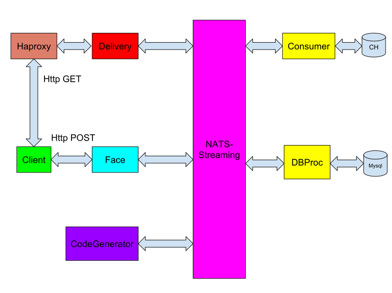

# urlcutter
## RU

Это небольшой  проект в котором я попробую реализовать сокращатель урлов, реализоваа это дело через микросервисы

Схема взаимодействия сервисов:

Список микросервисов:
* haproxy
* delivery
* face
* generator
* dbproc
* nats
* consumer
* clickhouse
* mysql

### Общение между сервисами

На данном этапе выбор делаю в пользу общения через nats,
т.е. вместо общения через http, будут продюсироватся сообщени в nats,
сообщения будут передаватся в JSON формате.

#### Общение face и delyvery с dbproc

имя очереди: dbproc

формат сообщений:

*это в сторону dbproc*

{"name":"face",
"title":"code",
"msg":"new"}

{"name":"delivery",
"title":"code",
"msg":"existed",
"code":"%somecode%"}

*Это в сторонy delivery и face*

{"name":"dbproc",
"title":"code",
"code":"%somecode%"}

### Общение dbproc и generator

*сообщение в сторону generator*

{"name":"dbproc","title":"code","msg":"%number%"}

*сообщение в сторону dbproc*

{"name":"generator","title":"code","msg":"%somecode%"}

## EN
